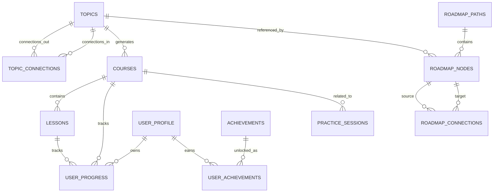
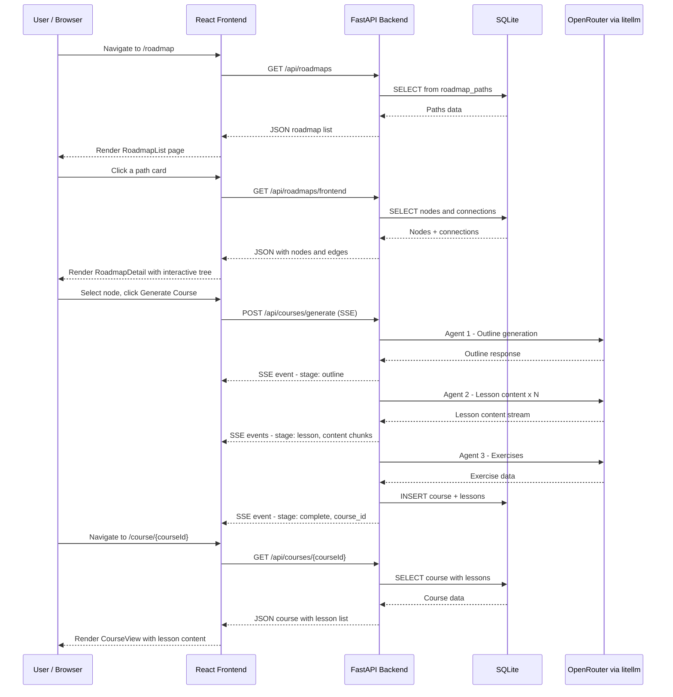
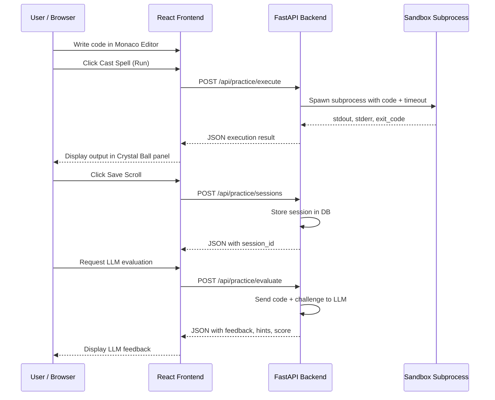
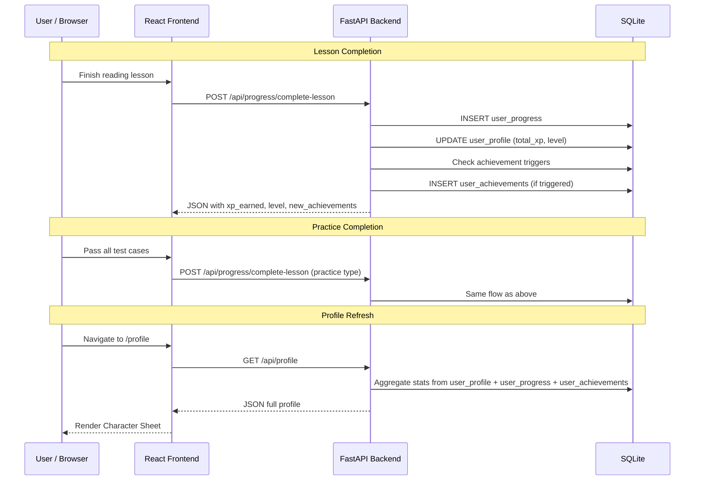
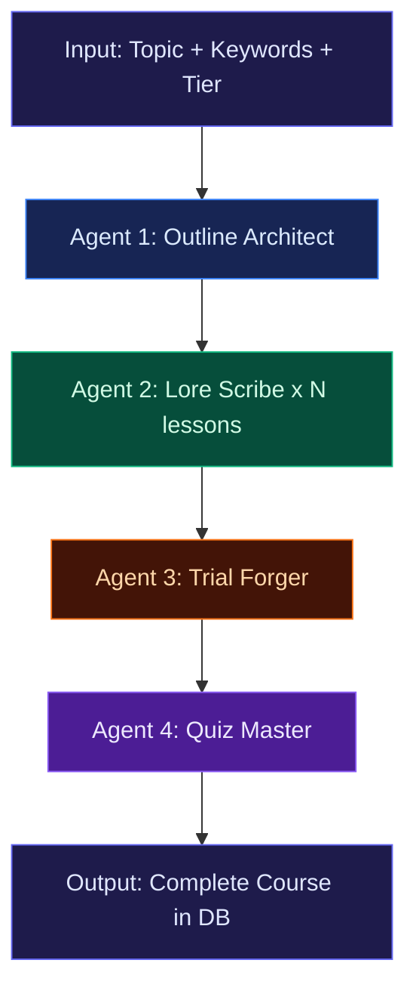

# MythicCode — Architecture Document

> AI-powered course generator with D&D gamification.
> Inspired by [boot.dev](https://boot.dev) and [roadmap.sh](https://roadmap.sh).

---

## Table of Contents

1. [Project Structure](#1-project-structure)
2. [Backend Architecture](#2-backend-architecture)
3. [Database Schema](#3-database-schema)
4. [Frontend Architecture Changes](#4-frontend-architecture-changes)
5. [Data Flow Diagrams](#5-data-flow-diagrams)
6. [LLM Multi-Agent Pipeline](#6-llm-multi-agent-pipeline)
7. [Roadmap.sh Integration Strategy](#7-roadmapsh-integration-strategy)
8. [Gamification System Design](#8-gamification-system-design)
9. [Development Workflow](#9-development-workflow)
10. [Implementation Phases](#10-implementation-phases)
11. [Package Cleanup Plan](#11-package-cleanup-plan)

---

## 1. Project Structure

Monorepo with React frontend and Python FastAPI backend. In production, FastAPI serves the built Vite bundle. In development, Vite dev server proxies API calls to FastAPI.

```
code-course/
├── server/                          # Python FastAPI backend
│   ├── __init__.py
│   ├── main.py                      # FastAPI app factory, static file serving
│   ├── config.py                    # Settings via pydantic-settings, reads .env
│   ├── database.py                  # SQLAlchemy engine, session factory
│   ├── routers/                     # API route modules
│   │   ├── __init__.py
│   │   ├── roadmaps.py              # Roadmap paths, nodes, connections
│   │   ├── courses.py               # Course CRUD, generation trigger
│   │   ├── topics.py                # Topic management
│   │   ├── progress.py              # XP, completion, level tracking
│   │   ├── practice.py              # Code execution and evaluation
│   │   └── profile.py               # User stats and achievements
│   ├── services/                    # Business logic layer
│   │   ├── __init__.py
│   │   ├── course_service.py        # Course generation orchestration
│   │   ├── progress_service.py      # XP calculation, leveling logic
│   │   ├── practice_service.py      # Code execution sandbox
│   │   └── profile_service.py       # Aggregated user stats
│   ├── llm/                         # LLM integration layer
│   │   ├── __init__.py
│   │   ├── client.py                # litellm wrapper, OpenRouter config
│   │   ├── prompts/                 # Prompt template files
│   │   │   ├── outline.py           # Topic research and outline
│   │   │   ├── lesson.py            # Lesson content with D&D flavor
│   │   │   ├── exercises.py         # Code examples and exercises
│   │   │   └── quiz.py              # Evaluation and quiz generation
│   │   ├── agents/                  # Multi-agent pipeline definitions
│   │   │   ├── __init__.py
│   │   │   └── course_pipeline.py   # Sequential course generation agents
│   │   └── streaming.py             # SSE streaming helpers
│   ├── models/                      # SQLAlchemy ORM models
│   │   ├── __init__.py
│   │   ├── topic.py                 # Topic definitions
│   │   ├── roadmap.py               # RoadmapPath, RoadmapNode, RoadmapConnection
│   │   ├── course.py                # Course, Lesson
│   │   └── progress.py              # UserProgress, UserProfile
│   ├── schemas/                     # Pydantic request/response schemas
│   │   ├── __init__.py
│   │   ├── roadmap.py
│   │   ├── course.py
│   │   ├── topic.py
│   │   ├── progress.py
│   │   └── profile.py
│   ├── seed/                        # Database seed data
│   │   ├── __init__.py
│   │   ├── seed_roadmaps.py         # Roadmap seed script
│   │   └── data/                    # JSON files for roadmap data
│   │       ├── frontend.json
│   │       ├── backend.json
│   │       ├── devops.json
│   │       └── database.json
│   └── alembic/                     # Database migrations
│       ├── alembic.ini
│       ├── env.py
│       └── versions/
├── src/                             # React frontend (existing, enhanced)
│   ├── main.tsx
│   ├── app/
│   │   ├── App.tsx
│   │   ├── routes.tsx
│   │   ├── components/
│   │   │   ├── Layout.tsx
│   │   │   ├── ui/                  # shadcn/ui components (pruned)
│   │   │   └── figma/
│   │   └── pages/
│   │       ├── Home.tsx
│   │       ├── RoadmapList.tsx
│   │       ├── RoadmapDetail.tsx
│   │       ├── Practice.tsx
│   │       ├── CreateCourse.tsx
│   │       ├── CourseView.tsx        # NEW — lesson viewer page
│   │       └── Profile.tsx
│   ├── api/                         # NEW — API client layer
│   │   ├── client.ts                # Fetch wrapper with base URL
│   │   ├── roadmaps.ts              # Roadmap API functions
│   │   ├── courses.ts               # Course API functions
│   │   ├── progress.ts              # Progress API functions
│   │   ├── practice.ts              # Practice API functions
│   │   └── profile.ts               # Profile API functions
│   ├── stores/                      # NEW — Zustand state stores
│   │   ├── progress-store.ts        # XP, level, completions
│   │   └── ui-store.ts              # Sidebar state, theme, etc.
│   ├── hooks/                       # NEW — Custom React hooks
│   │   ├── use-roadmaps.ts          # TanStack Query hooks for roadmaps
│   │   ├── use-courses.ts           # TanStack Query hooks for courses
│   │   ├── use-progress.ts          # TanStack Query hooks for progress
│   │   └── use-profile.ts           # TanStack Query hooks for profile
│   ├── lib/
│   │   └── utils.ts
│   └── styles/
│       ├── fonts.css
│       ├── index.css
│       ├── tailwind.css
│       └── theme.css
├── .env                             # Environment variables (gitignored)
├── .env.example                     # Template for .env
├── package.json                     # Frontend dependencies
├── pyproject.toml                   # Python project config (uv/pip)
├── vite.config.ts                   # Vite config with API proxy
├── postcss.config.mjs
├── index.html
├── ARCHITECTURE.md                  # This file
└── README.md
```

### Deleted from Current Structure

| Path              | Reason                                                 |
| ----------------- | ------------------------------------------------------ |
| `supabase/`       | Unused Supabase boilerplate — replaced by local SQLite |
| `utils/supabase/` | Supabase utility code — no longer needed               |

---

## 2. Backend Architecture

### 2.1 FastAPI Application Structure

```
main.py
  ├── Mounts built Vite frontend at / (production)
  ├── Includes CORS middleware (development)
  └── Registers routers under /api prefix

Layers:
  Router  →  Service  →  Model/LLM
  (HTTP)     (Logic)     (Data/AI)
```

[`server/main.py`](server/main.py) creates the FastAPI app instance, registers routers, configures middleware, and in production mode mounts the `dist/` directory as static files with a catch-all route for SPA client-side routing.

### 2.2 API Endpoint Design

All endpoints are prefixed with `/api`.

#### Roadmap API — [`server/routers/roadmaps.py`](server/routers/roadmaps.py)

| Method | Path                      | Description                                            |
| ------ | ------------------------- | ------------------------------------------------------ |
| `GET`  | `/api/roadmaps`           | List all roadmap paths with summary stats              |
| `GET`  | `/api/roadmaps/{path_id}` | Get single roadmap path with all nodes and connections |

**Response shape for `GET /api/roadmaps/{path_id}`:**

```json
{
  "id": 1,
  "title": "Path of the Visionary - Frontend",
  "description": "Master the ancient arts of HTML, CSS, React...",
  "icon": "Monitor",
  "colors": "from-blue-500 to-cyan-500",
  "total_nodes": 24,
  "completed_nodes": 8,
  "nodes": [
    {
      "id": 1,
      "title": "HTML Glyphs",
      "description": "The foundational language of the visual realm.",
      "position_x": 50,
      "position_y": 20,
      "status": "completed",
      "tier": 1
    }
  ],
  "connections": [{ "from_node_id": 1, "to_node_id": 2, "type": "default" }]
}
```

#### Course Generation API — [`server/routers/courses.py`](server/routers/courses.py)

| Method   | Path                                           | Description                                                 |
| -------- | ---------------------------------------------- | ----------------------------------------------------------- |
| `POST`   | `/api/courses/generate`                        | Trigger course generation from a topic (returns SSE stream) |
| `GET`    | `/api/courses`                                 | List all generated courses                                  |
| `GET`    | `/api/courses/{course_id}`                     | Get course with lesson list                                 |
| `DELETE` | `/api/courses/{course_id}`                     | Delete a generated course                                   |
| `GET`    | `/api/courses/{course_id}/lessons/{lesson_id}` | Get full lesson content                                     |

**`POST /api/courses/generate` request body:**

```json
{
  "topic_ids": [5, 12],
  "model": "anthropic/claude-sonnet-4-20250514"
}
```

**Response:** Server-Sent Events (SSE) stream. Each event contains a JSON payload:

```
event: status
data: {"stage": "outline", "message": "Generating course outline..."}

event: chunk
data: {"stage": "lesson", "lesson_index": 0, "content_delta": "# The Arcane..."}

event: complete
data: {"course_id": "uuid-here", "total_lessons": 5}
```

#### Course Storage API — [`server/routers/courses.py`](server/routers/courses.py)

Included in the courses router above. Full CRUD for persisted course data.

#### Progress API — [`server/routers/progress.py`](server/routers/progress.py)

| Method | Path                               | Description                         |
| ------ | ---------------------------------- | ----------------------------------- |
| `POST` | `/api/progress/complete-lesson`    | Mark lesson complete, award XP      |
| `GET`  | `/api/progress/summary`            | Get overall progress summary        |
| `GET`  | `/api/progress/roadmap/{path_id}`  | Get progress for a specific roadmap |
| `GET`  | `/api/progress/course/{course_id}` | Get progress for a specific course  |

**`POST /api/progress/complete-lesson` request body:**

```json
{
  "lesson_id": "uuid-here",
  "course_id": "uuid-here",
  "time_spent_seconds": 342
}
```

**Response:**

```json
{
  "xp_earned": 150,
  "total_xp": 14400,
  "level_before": 12,
  "level_after": 12,
  "xp_to_next_level": 1100,
  "new_achievements": [],
  "node_completed": false
}
```

#### Practice API — [`server/routers/practice.py`](server/routers/practice.py)

| Method | Path                                  | Description                            |
| ------ | ------------------------------------- | -------------------------------------- |
| `POST` | `/api/practice/execute`               | Execute code in sandbox, return output |
| `POST` | `/api/practice/evaluate`              | LLM-evaluate code solution             |
| `GET`  | `/api/practice/sessions`              | List saved practice sessions           |
| `POST` | `/api/practice/sessions`              | Save a practice session                |
| `GET`  | `/api/practice/sessions/{session_id}` | Get a saved session                    |

**Code execution approach:** Use Python `subprocess` with `RestrictedPython` or `docker` (if available) to execute user JavaScript/Python code in a sandboxed environment. For the local-only scope:

- **JavaScript**: Run via Node.js subprocess with `--max-old-space-size=64` and a 5-second timeout
- **Python**: Run via a subprocess with `resource` limits (Linux) or simple timeout (Windows)
- Capture stdout, stderr, and exit code
- No network access, no filesystem writes

**`POST /api/practice/execute` request body:**

```json
{
  "code": "function traverseMaze(depth) { ... }",
  "language": "javascript",
  "test_cases": [{ "input": "5", "expected_output": "32" }]
}
```

#### Profile API — [`server/routers/profile.py`](server/routers/profile.py)

| Method | Path                        | Description                                         |
| ------ | --------------------------- | --------------------------------------------------- |
| `GET`  | `/api/profile`              | Get full user profile (stats, skills, achievements) |
| `PUT`  | `/api/profile`              | Update display name, avatar seed                    |
| `GET`  | `/api/profile/achievements` | List all achievements with unlock status            |
| `GET`  | `/api/profile/skills`       | Get skill levels per topic area                     |
| `GET`  | `/api/profile/activity`     | Get recent activity feed                            |

**Response shape for `GET /api/profile`:**

```json
{
  "display_name": "Sir Codealot",
  "avatar_seed": "Felix",
  "level": 12,
  "title": "Frontend Mage",
  "total_xp": 14250,
  "xp_to_next_level": 1250,
  "quests_completed": 42,
  "current_path": {
    "id": "frontend",
    "title": "Path of the Visionary"
  },
  "skills": [
    { "name": "HTML/CSS Glyphs", "level": 9, "xp": 4500 },
    { "name": "JavaScript Incantations", "level": 7, "xp": 3200 }
  ],
  "achievements": [
    {
      "id": "first_blood",
      "title": "First Blood",
      "description": "Solved a syntax error without Google.",
      "unlocked": true,
      "unlocked_at": "2026-01-15T10:30:00Z"
    }
  ]
}
```

### 2.3 LLM Integration Layer

[`server/llm/client.py`](server/llm/client.py) — Central litellm configuration:

```python
import litellm

litellm.api_base = "https://openrouter.ai/api/v1"
litellm.api_key = settings.openrouter_api_key

# Default model, overridable per-request
DEFAULT_MODEL = "anthropic/claude-sonnet-4-20250514"

async def completion(messages, model=None, stream=False, **kwargs):
    """Unified completion call through litellm → OpenRouter."""
    return await litellm.acompletion(
        model=model or DEFAULT_MODEL,
        messages=messages,
        stream=stream,
        **kwargs
    )
```

**Streaming to frontend:** [`server/llm/streaming.py`](server/llm/streaming.py) converts litellm async generator into FastAPI `StreamingResponse` with `text/event-stream` content type.

### 2.4 Error Handling Strategy

| Layer          | Strategy                                                                                          |
| -------------- | ------------------------------------------------------------------------------------------------- |
| Router         | FastAPI exception handlers; return structured JSON errors `{"error": "...", "detail": "..."}`     |
| Service        | Raise custom exceptions (`CourseNotFoundError`, `LLMError`, `ExecutionTimeoutError`)              |
| LLM            | Retry with exponential backoff (3 attempts); fall back to alternative model on persistent failure |
| Database       | SQLAlchemy exceptions caught in service layer; wrapped in HTTP 500 with log                       |
| Code Execution | Timeout after 5s; memory limit; stderr captured and returned                                      |

Global exception handler in [`server/main.py`](server/main.py):

```python
@app.exception_handler(AppError)
async def app_error_handler(request, exc):
    return JSONResponse(
        status_code=exc.status_code,
        content={"error": exc.error_code, "detail": exc.message}
    )
```

---

## 3. Database Schema

SQLite database stored at `server/mythiccode.db`. Managed via SQLAlchemy ORM with Alembic migrations.

### 3.1 Entity-Relationship Diagram



### 3.2 Table Definitions

#### `topics`

Central topic repository for the topic-based learning system. Topics can be user-created or AI-generated.

| Column         | Type      | Constraints            | Description                         |
| -------------- | --------- | ---------------------- | ----------------------------------- |
| `id`           | `INTEGER` | PK AUTOINCREMENT       | Unique identifier                   |
| `title`        | `TEXT`    | NOT NULL               | Topic title, e.g. `Python Basics`   |
| `description`  | `TEXT`    |                        | Topic description                   |
| `ai_generated` | `BOOLEAN` | NOT NULL DEFAULT FALSE | Whether created by AI               |
| `keywords`     | `TEXT`    |                        | Comma-separated keywords for search |

#### `topic_connections`

Defines relationships between topics (prerequisites, subtopics, etc.).

| Column              | Type      | Constraints                     | Description                               |
| ------------------- | --------- | ------------------------------- | ----------------------------------------- |
| `id`                | `INTEGER` | PK AUTOINCREMENT                | —                                         |
| `from_topic_id`     | `INTEGER` | FK → `topics.id`, NOT NULL      | Source topic                              |
| `to_topic_id`       | `INTEGER` | FK → `topics.id`, NOT NULL      | Target topic                              |
| `relationship_type` | `TEXT`    | NOT NULL DEFAULT `prerequisite` | `prerequisite`, `subtopic`, `related`     |
| `ai_confidence`     | `REAL`    |                                 | AI confidence score (0-1) if AI-generated |

#### `roadmap_paths`

Represents a top-level learning path (e.g., Frontend, Backend).

| Column        | Type        | Constraints                     | Description                                                  |
| ------------- | ----------- | ------------------------------- | ------------------------------------------------------------ |
| `id`          | `INTEGER`   | PK AUTOINCREMENT                | Unique identifier                                            |
| `title`       | `TEXT`      | NOT NULL                        | Display title, e.g. `Path of the Visionary - Frontend`       |
| `description` | `TEXT`      |                                 | Short description                                            |
| `icon`        | `TEXT`      |                                 | Lucide icon name, e.g. `Monitor`                             |
| `colors`      | `TEXT`      |                                 | Tailwind gradient class, e.g. `from-orange-500 to-amber-500` |
| `sort_order`  | `INTEGER`   | DEFAULT 0                       | Display ordering                                             |
| `is_locked`   | `BOOLEAN`   | DEFAULT FALSE                   | Whether the path is locked                                   |
| `user_id`     | `INTEGER`   | FK → user_profiles.id, NULLABLE | Owner user (NULL for system paths)                           |
| `is_custom`   | `BOOLEAN`   | DEFAULT FALSE                   | Whether user-created                                         |
| `created_at`  | `TIMESTAMP` |                                 | Creation timestamp                                           |

#### `roadmap_nodes`

Individual nodes within a roadmap path, linked to topics.

| Column       | Type      | Constraints                       | Description                                       |
| ------------ | --------- | --------------------------------- | ------------------------------------------------- |
| `id`         | `INTEGER` | PK AUTOINCREMENT                  | Unique identifier                                 |
| `path_id`    | `INTEGER` | FK → `roadmap_paths.id`, NOT NULL | Parent path                                       |
| `topic_id`   | `INTEGER` | FK → `topics.id`, NOT NULL        | Associated topic                                  |
| `position_x` | `INTEGER` | DEFAULT 0                         | X position on roadmap canvas                      |
| `position_y` | `INTEGER` | DEFAULT 0                         | Y position on roadmap canvas                      |
| `tier`       | `INTEGER` | DEFAULT 1                         | Difficulty tier (1=beginner ... 5=expert)         |
| `status`     | `TEXT`    | DEFAULT `locked`                  | `locked`, `available`, `in_progress`, `completed` |

#### `roadmap_connections`

Directed edges between nodes for rendering the tree.

| Column            | Type      | Constraints                       | Description           |
| ----------------- | --------- | --------------------------------- | --------------------- |
| `id`              | `INTEGER` | PK AUTOINCREMENT                  | —                     |
| `path_id`         | `INTEGER` | FK → `roadmap_paths.id`, NOT NULL | Parent path           |
| `from_node_id`    | `INTEGER` | FK → `roadmap_nodes.id`, NOT NULL | Source node           |
| `to_node_id`      | `INTEGER` | FK → `roadmap_nodes.id`, NOT NULL | Target node           |
| `connection_type` | `TEXT`    | DEFAULT `default`                 | Connection style type |

**Unique constraint:** `(from_node_id, to_node_id)`

#### `courses`

Generated course content (from topics).

| Column          | Type        | Constraints                | Description                                           |
| --------------- | ----------- | -------------------------- | ----------------------------------------------------- |
| `id`            | `INTEGER`   | PK AUTOINCREMENT           | Unique identifier                                     |
| `title`         | `TEXT`      | NOT NULL                   | Course title, e.g. `The Arcane Art of CSS`            |
| `description`   | `TEXT`      |                            | Course summary                                        |
| `topic_id`      | `INTEGER`   | FK → `topics.id`, NOT NULL | Primary topic for the course                          |
| `total_lessons` | `INTEGER`   | DEFAULT 0                  | Lesson count                                          |
| `total_xp`      | `INTEGER`   | DEFAULT 0                  | Total XP available in this course                     |
| `status`        | `TEXT`      | DEFAULT `locked`           | `locked`, `generating`, `ready`, `completed`, `error` |
| `created_at`    | `TIMESTAMP` |                            | Creation timestamp                                    |

#### `lessons`

Individual lessons within a course. Each lesson includes an interactive task.

| Column             | Type        | Constraints                                   | Description                            |
| ------------------ | ----------- | --------------------------------------------- | -------------------------------------- |
| `id`               | `INTEGER`   | PK AUTOINCREMENT                              | Unique identifier                      |
| `course_id`        | `INTEGER`   | FK → `courses.id` ON DELETE CASCADE, NOT NULL | Parent course                          |
| `title`            | `TEXT`      | NOT NULL                                      | Lesson title                           |
| `content_markdown` | `TEXT`      |                                               | Full lesson content in Markdown        |
| `task_type`        | `TEXT`      |                                               | Task type: `quiz`, `coding`, `project` |
| `task_content`     | `TEXT`      |                                               | Task instructions and requirements     |
| `sort_order`       | `INTEGER`   | DEFAULT 0                                     | Position within course                 |
| `xp_reward`        | `INTEGER`   | DEFAULT 10                                    | XP awarded on completion               |
| `created_at`       | `TIMESTAMP` |                                               | —                                      |

#### `user_profile`

Single-row table (local-only, no auth — one implicit user).

| Column            | Type        | Constraints                       | Description            |
| ----------------- | ----------- | --------------------------------- | ---------------------- |
| `id`              | `INTEGER`   | PK DEFAULT 1                      | Always 1 (single user) |
| `display_name`    | `TEXT`      | NOT NULL DEFAULT `Adventurer`     | Character name         |
| `avatar_seed`     | `TEXT`      | NOT NULL DEFAULT `Felix`          | DiceBear avatar seed   |
| `total_xp`        | `INTEGER`   | NOT NULL DEFAULT 0                | Lifetime XP earned     |
| `level`           | `INTEGER`   | NOT NULL DEFAULT 1                | Current level          |
| `current_path_id` | `INTEGER`   | FK → `roadmap_paths.id`, NULLABLE | Active roadmap path    |
| `created_at`      | `TIMESTAMP` |                                   | —                      |
| `updated_at`      | `TIMESTAMP` |                                   | —                      |

**Note:** `username`, `email`, `avatar_url`, and `title` columns do not exist in the actual schema.

#### `user_progress`

Tracks completion of individual lessons.

| Column               | Type        | Constraints                 | Description                    |
| -------------------- | ----------- | --------------------------- | ------------------------------ |
| `id`                 | `INTEGER`   | PK AUTOINCREMENT            | —                              |
| `lesson_id`          | `INTEGER`   | FK → `lessons.id`, NOT NULL | Completed lesson               |
| `course_id`          | `INTEGER`   | FK → `courses.id`, NOT NULL | Parent course                  |
| `xp_earned`          | `INTEGER`   |                             | XP awarded for this completion |
| `time_spent_seconds` | `INTEGER`   |                             | Time spent on lesson           |
| `completed_at`       | `TIMESTAMP` |                             | —                              |

**Unique constraint:** `(lesson_id)` — a lesson can only be completed once.

#### `achievements`

Master list of all possible achievements.

| Column          | Type      | Constraints        | Description                                                                             |
| --------------- | --------- | ------------------ | --------------------------------------------------------------------------------------- |
| `id`            | `TEXT`    | PK                 | Slug, e.g. `first_blood`                                                                |
| `title`         | `TEXT`    | NOT NULL           | Display title                                                                           |
| `description`   | `TEXT`    | NOT NULL           | How to earn it                                                                          |
| `icon`          | `TEXT`    | NOT NULL           | Lucide icon name                                                                        |
| `category`      | `TEXT`    | NOT NULL           | `combat`, `exploration`, `crafting`, `mastery`                                          |
| `xp_bonus`      | `INTEGER` | NOT NULL DEFAULT 0 | Bonus XP when unlocked                                                                  |
| `trigger_type`  | `TEXT`    | NOT NULL           | `lesson_count`, `course_count`, `xp_total`, `streak`, `path_complete`, `practice_count` |
| `trigger_value` | `INTEGER` | NOT NULL           | Threshold value for trigger                                                             |

#### `user_achievements`

Join table for unlocked achievements.

| Column           | Type        | Constraints                      | Description        |
| ---------------- | ----------- | -------------------------------- | ------------------ |
| `id`             | `INTEGER`   | PK AUTOINCREMENT                 | —                  |
| `achievement_id` | `TEXT`      | FK → `achievements.id`, NOT NULL | —                  |
| `unlocked_at`    | `TIMESTAMP` | NOT NULL DEFAULT NOW             | When it was earned |

**Unique constraint:** `(achievement_id)`

#### `practice_sessions`

Saved code practice attempts. **Note:** This model is defined inline in `practice_service.py`, NOT as a separate model file.

| Column       | Type        | Constraints                    | Description                             |
| ------------ | ----------- | ------------------------------ | --------------------------------------- |
| `id`         | `INTEGER`   | PK AUTOINCREMENT               | Unique identifier                       |
| `course_id`  | `TEXT`      | FK → `courses.id`, NULLABLE    | Related course (BUG: should be INTEGER) |
| `lesson_id`  | `TEXT`      | FK → `lessons.id`, NULLABLE    | Related lesson (BUG: should be INTEGER) |
| `title`      | `TEXT`      | NOT NULL                       | Session title / challenge name          |
| `language`   | `TEXT`      | NOT NULL                       | `javascript` or `python`                |
| `code`       | `TEXT`      | NOT NULL                       | Saved code                              |
| `output`     | `TEXT`      |                                | Last execution output                   |
| `status`     | `TEXT`      | NOT NULL DEFAULT `in_progress` | `in_progress`, `passed`, `failed`       |
| `created_at` | `TIMESTAMP` | NOT NULL DEFAULT NOW           | —                                       |
| `updated_at` | `TIMESTAMP` | NOT NULL DEFAULT NOW           | —                                       |

**Known Issue:** The `course_id` and `lesson_id` columns are defined as TEXT but should be INTEGER to match the foreign key types. This is a type mismatch bug in the current implementation.

### 3.3 Migration Strategy

Use **Alembic** for schema migrations:

- `alembic.ini` lives at `server/alembic/alembic.ini`
- `alembic/env.py` imports all models from `server/models/` and targets `server/mythiccode.db`
- Initial migration creates all tables above
- Seed data script (`server/seed/seed_roadmaps.py`) runs after migration to populate roadmap paths, nodes, connections, and achievement definitions
- Run migrations via: `cd server && alembic upgrade head`

### 3.4 Topic-Based Learning System

The platform supports a topic-based learning system that allows flexible course generation:

**Key Features:**

- **Topic Repository**: Central `topics` table stores all learning topics, both system-defined and AI-generated
- **Topic Connections**: Relationships between topics (prerequisites, subtopics) enable building learning graphs
- **Multi-Topic Courses**: Users can select multiple related subtopics to generate custom courses covering specific skill combinations
- **Dynamic Roadmaps**: AI can generate custom roadmap paths on-demand for any topic

**Course Generation Flow:**

1. User selects a primary topic and optionally multiple subtopics
2. System validates all topic IDs exist in the database
3. LLM generates a unified course outline covering all selected topics
4. Lessons are generated with progressive difficulty across the topic scope
5. Course is associated with the primary topic for tracking and organization

**API Endpoint:** `POST /api/topics/generate-roadmap` — Creates a custom roadmap path with AI-generated subtopics for any learning goal.

### 3.5 Lesson Tasks & AI Evaluation

Each lesson includes an interactive task that tests understanding:

**Task Types:**
| Type | Description | Example |
|------|-------------|---------|
| `quiz` | Multiple-choice questions | "What is the output of `2 + '2'` in JavaScript?" |
| `coding` | Write code to solve a problem | "Write a function that reverses a string" |
| `project` | Build a small project | "Create a todo list component with React" |

**Task Structure:**

- `task_type`: The type of task (`quiz`, `coding`, `project`)
- `task_content`: Instructions, requirements, and any starter code

**AI Evaluation:**
The `POST /api/courses/{course_id}/lessons/{lesson_id}/evaluate` endpoint uses LLM to:

- Evaluate user submissions against task requirements
- Provide detailed feedback on correctness and approach
- Suggest improvements and learning resources
- Return a boolean `is_correct` flag and textual `feedback`

Evaluation uses a dedicated evaluation prompt that considers:

- The original task requirements
- The user's submitted answer
- Partial credit for partially correct solutions
- Code quality and best practices (for coding tasks)

---

## 4. Frontend Architecture Changes

### 4.1 State Management

**Two-tier approach:**

| Concern                 | Tool                             | Rationale                                                                 |
| ----------------------- | -------------------------------- | ------------------------------------------------------------------------- |
| Server state (API data) | **TanStack Query** (React Query) | Caching, refetching, loading/error states, SSE streaming                  |
| Client state (UI)       | **Zustand**                      | Lightweight, no boilerplate, good for sidebar state, theme, notifications |

TanStack Query eliminates the need for manual `useState` + `useEffect` patterns for data fetching. Every API call gets automatic caching, background refetching, and stale-while-revalidate behavior.

### 4.2 API Client Layer

[`src/api/client.ts`](src/api/client.ts) — Thin fetch wrapper:

```typescript
const BASE_URL = '/api';

export async function apiGet<T>(path: string): Promise<T> {
  const res = await fetch(`${BASE_URL}${path}`);
  if (!res.ok) throw new ApiError(res.status, await res.json());
  return res.json();
}

export async function apiPost<T>(path: string, body?: unknown): Promise<T> {
  const res = await fetch(`${BASE_URL}${path}`, {
    method: 'POST',
    headers: { 'Content-Type': 'application/json' },
    body: body ? JSON.stringify(body) : undefined,
  });
  if (!res.ok) throw new ApiError(res.status, await res.json());
  return res.json();
}

export function apiStream(path: string, body: unknown): EventSource {
  // For SSE streaming (course generation)
}
```

Each domain module (`src/api/roadmaps.ts`, etc.) exports typed functions:

```typescript
// src/api/roadmaps.ts
export const fetchRoadmaps = () => apiGet<RoadmapPath[]>('/roadmaps');
export const fetchRoadmap = (id: string) => apiGet<RoadmapDetail>(`/roadmaps/${id}`);
```

### 4.3 TanStack Query Hooks

[`src/hooks/use-roadmaps.ts`](src/hooks/use-roadmaps.ts) — Example:

```typescript
export function useRoadmaps() {
  return useQuery({ queryKey: ['roadmaps'], queryFn: fetchRoadmaps });
}

export function useRoadmap(pathId: string) {
  return useQuery({
    queryKey: ['roadmaps', pathId],
    queryFn: () => fetchRoadmap(pathId),
    enabled: !!pathId,
  });
}
```

### 4.4 Page Transition Strategy

Each page transitions from static mockup to dynamic data:

| Page                                                   | Current State                          | Target State                                                                     |
| ------------------------------------------------------ | -------------------------------------- | -------------------------------------------------------------------------------- |
| [`Home.tsx`](src/app/pages/Home.tsx)                   | Hardcoded "Level 12", "60% progress"   | Fetches from `/api/profile` and `/api/progress/summary`                          |
| [`RoadmapList.tsx`](src/app/pages/RoadmapList.tsx)     | Hardcoded `ROADMAPS` array             | Fetches from `/api/roadmaps`, progress from `/api/progress/roadmap/{id}`         |
| [`RoadmapDetail.tsx`](src/app/pages/RoadmapDetail.tsx) | Hardcoded `ROADMAP_DATA` object        | Fetches from `/api/roadmaps/{path_id}` with nodes and connections                |
| [`Practice.tsx`](src/app/pages/Practice.tsx)           | Static mock editor with `<pre>` blocks | Monaco Editor integration, executes via `/api/practice/execute`                  |
| [`CreateCourse.tsx`](src/app/pages/CreateCourse.tsx)   | Static upload UI                       | Course generation from selected topics                                           |
| [`Profile.tsx`](src/app/pages/Profile.tsx)             | Hardcoded stats                        | Fetches from `/api/profile`                                                      |
| **`CourseView.tsx`** (NEW)                             | —                                      | New page at `/course/:courseId`, shows generated lessons with markdown rendering |

### 4.5 Code Editor Integration

Replace the mock `<pre>` code block in [`Practice.tsx`](src/app/pages/Practice.tsx) with **Monaco Editor** (`@monaco-editor/react`):

- Language support: JavaScript, Python (matches sandbox execution)
- Theme: VS Code Dark+ (matches the existing dark aesthetic)
- Features: Syntax highlighting, auto-completion, bracket matching, minimap
- The editor's value is sent to `/api/practice/execute` on "Cast Spell (Run)" button click
- Console output panel below editor shows stdout/stderr from execution

### 4.6 New Route Addition

Add to [`src/app/routes.tsx`](src/app/routes.tsx:10):

```typescript
{ path: "course/:courseId", Component: CourseView },
{ path: "course/:courseId/lesson/:lessonId", Component: CourseView },
```

### 4.7 Markdown Rendering

Course lesson content is stored as Markdown. Use `react-markdown` with `remark-gfm` and `rehype-highlight` for:

- Headings, lists, tables, code blocks with syntax highlighting
- D&D-themed styling via custom CSS classes on the markdown container

---

## 5. Data Flow Diagrams

### 5.1 Roadmap Browsing → Course Generation → Lesson Viewing



### 5.2 Practice Coding → Execution → Evaluation



### 5.3 Progress Tracking Through All Activities



---

## 6. LLM Multi-Agent Pipeline

### 6.1 Course Generation from Topic

Sequential pipeline — each agent's output feeds the next. Defined in [`server/llm/agents/course_pipeline.py`](server/llm/agents/course_pipeline.py).



#### Agent 1: Outline Architect

- **Input:** Topic name, description, tier level, related keywords from `roadmap_nodes.topic_keywords`
- **Prompt:** Generate a structured course outline with 4-8 lessons, each with a title, learning objectives, and estimated complexity. Use D&D quest terminology.
- **Output:** JSON outline with lesson titles and objectives
- **Model:** Fast model (e.g., `anthropic/claude-haiku-3`)
- **Tokens:** ~500 input, ~1000 output

#### Agent 2: Lore Scribe (runs N times, once per lesson)

- **Input:** Course outline + specific lesson objectives from Agent 1
- **Prompt:** Write comprehensive lesson content in Markdown. Include D&D flavor text. Explain concepts clearly with analogies. Include at least one code example per lesson.
- **Output:** Markdown content per lesson
- **Model:** Strong model (e.g., `anthropic/claude-sonnet-4-20250514`)
- **Tokens:** ~1000 input, ~2000-4000 output per lesson
- **Parallelization:** Can run up to 3 lessons concurrently to speed up generation

#### Agent 3: Trial Forger

- **Input:** Lesson content from Agent 2 (all lessons)
- **Prompt:** Create 1-2 coding exercises per lesson with starter code, test cases, and hints. Frame as D&D trials/challenges.
- **Output:** JSON array of exercises per lesson
- **Model:** Strong model (e.g., `anthropic/claude-sonnet-4-20250514`)
- **Tokens:** ~3000 input (all lesson content), ~2000 output

#### Agent 4: Quiz Master

- **Input:** Lesson content from Agent 2 (all lessons)
- **Prompt:** Create 3-5 multiple-choice questions per lesson to evaluate understanding. Include D&D-themed distractors.
- **Output:** JSON array of quiz questions per lesson
- **Model:** Fast model (e.g., `anthropic/claude-haiku-3`)
- **Tokens:** ~3000 input, ~1500 output

**Total approximate tokens per course:** ~20,000–40,000 (varies by lesson count and content depth)

### 6.2 Agent Communication Pattern

**Sequential pipeline with shared context:**

```python
class PipelineContext:
    """Shared state passed through all agents in a pipeline."""
    topic: str
    outline: CourseOutline | None = None
    lessons: list[LessonContent] = []
    exercises: list[ExerciseSet] = []
    quizzes: list[QuizSet] = []
    status_callback: Callable  # SSE event emitter
```

Each agent receives the `PipelineContext`, reads what it needs, writes its output, and calls `status_callback` to emit SSE events.

### 6.3 Token Management and Context Window Strategy

| Concern           | Strategy                                                                         |
| ----------------- | -------------------------------------------------------------------------------- |
| Long documents    | Chunk into 6000-token windows with 500-token overlap                             |
| Lesson generation | Each lesson gets its own call — keeps context focused                            |
| Cost control      | Use fast models (Haiku) for structural tasks, strong models (Sonnet) for content |
| Rate limiting     | Sequential calls with 100ms delay between requests                               |
| Context budget    | Reserve 2000 tokens for system prompt, allocate remaining to content             |
| Failure recovery  | If a single lesson fails, retry that lesson only (not the whole pipeline)        |

### 6.4 Prompt Templates Structure

All prompts in [`server/llm/prompts/`](server/llm/prompts/) follow a consistent pattern:

```python
# server/llm/prompts/outline.py

SYSTEM_PROMPT = """You are the Outline Architect for MythicCode, a D&D-themed
programming education platform. You create structured course outlines that
transform technical topics into epic quest narratives..."""

def build_messages(topic: str, description: str, tier: int, keywords: list[str]):
    return [
        {"role": "system", "content": SYSTEM_PROMPT},
        {"role": "user", "content": f"Create a course outline for: {topic}\n\n"
         f"Description: {description}\n"
         f"Difficulty tier: {tier}/5\n"
         f"Related keywords: {', '.join(keywords)}\n\n"
         "Respond with a JSON object..."}
    ]
```

---

## 7. Roadmap.sh Integration Strategy

### 7.1 Data Sourcing Approach

**Manual curation from roadmap.sh** — not API or scraping.

Rationale:

- roadmap.sh has no public API
- Scraping is fragile and potentially against ToS
- The project only needs 4-6 roadmap paths, each with 15-30 nodes
- Manual curation allows D&D theming of every node title and description
- Data changes infrequently (roadmap.sh updates paths maybe 1-2x/year)

### 7.2 Data Format

Each roadmap path is stored as a JSON file in [`server/seed/data/`](server/seed/data/):

```json
{
  "id": 1,
  "title": "Path of the Visionary - Frontend",
  "description": "Master the ancient arts of HTML, CSS, React, and build beautiful illusions in the browser realm.",
  "icon": "Monitor",
  "colors": "from-orange-500 to-amber-500",
  "is_locked": false,
  "sort_order": 1,
  "nodes": [
    {
      "id": 1,
      "title": "Internet Arcana",
      "description": "Understanding the mystical web of DNS, HTTP, and Browsers.",
      "position_x": 50,
      "position_y": 5,
      "tier": 1,
      "topic_keywords": "internet,dns,http,https,browsers,hosting"
    },
    {
      "id": 2,
      "title": "HTML Glyphs",
      "description": "The foundational language of the visual realm.",
      "position_x": 50,
      "position_y": 15,
      "tier": 1,
      "topic_keywords": "html,semantic html,forms,tables,accessibility,seo"
    }
  ],
  "connections": [{ "from_node_id": 1, "to_node_id": 2, "connection_type": "default" }]
}
```

### 7.3 Seed Script

[`server/seed/seed_roadmaps.py`](server/seed/seed_roadmaps.py) reads all JSON files from `server/seed/data/`, inserts into `roadmap_paths`, `roadmap_nodes`, and `roadmap_connections` tables. Idempotent — uses SQLAlchemy queries with conditional create logic (checks for existing records before inserting).

### 7.4 Topic-to-Course Mapping

When a user clicks "Generate Course" on a roadmap node, the system uses:

- `roadmap_nodes.topic_id` — references the `topics` table
- `topics.title` — as the course topic name
- `topics.description` — as context for the LLM
- `topics.keywords` — as additional context to guide content generation
- `roadmap_nodes.tier` — to calibrate difficulty level in prompts

This data is passed directly to Agent 1 (Outline Architect) to generate a course tailored to that exact topic.

### 7.5 Initial Roadmap Paths

| Path ID    | D&D Title             | Source                    |
| ---------- | --------------------- | ------------------------- |
| `frontend` | Path of the Visionary | roadmap.sh/frontend       |
| `backend`  | Path of the Architect | roadmap.sh/backend        |
| `devops`   | Path of the Warden    | roadmap.sh/devops         |
| `database` | Path of the Keeper    | roadmap.sh/postgresql-dba |

Start with `frontend` fully populated (24 nodes). Other paths can start locked with 5-10 starter nodes.

---

## 8. Gamification System Design

### 8.1 D&D Theme Mapping

| App Concept        | D&D Equivalent     | Icon     | Color   |
| ------------------ | ------------------ | -------- | ------- |
| Roadmap Path       | Guild / Class Path | Compass  | Indigo  |
| Course             | Quest              | Scroll   | Amber   |
| Lesson             | Encounter / Trial  | BookOpen | Blue    |
| Practice Challenge | Arena Combat       | Swords   | Emerald |
| Profile Page       | Character Sheet    | Shield   | Purple  |
| Achievements       | Relics / Artifacts | Trophy   | Gold    |
| Home Page          | The Tavern         | Flame    | —       |
| Course Creation    | The Forge          | Wand2    | Pink    |
| XP                 | Experience Points  | Star     | Yellow  |
| Level              | Character Level    | —        | Purple  |

### 8.2 XP Calculation Rules

| Activity                                                | Base XP       | Modifiers                                                  |
| ------------------------------------------------------- | ------------- | ---------------------------------------------------------- |
| Complete a lesson                                       | 100 XP        | +50 if completed in under 5 minutes, +25 for first attempt |
| Pass a practice challenge                               | 150 XP        | +50 per additional test case passed                        |
| Complete all quiz questions (≥80% score)                | 75 XP         | +25 for 100% score                                         |
| Complete a full course (all lessons)                    | 500 XP bonus  | —                                                          |
| Complete a roadmap node (course generated and finished) | 300 XP bonus  | —                                                          |
| Daily streak (complete ≥1 lesson per day)               | 50 XP per day | Streak multiplier: x1.5 after 7 days, x2 after 30 days     |

### 8.3 Level Progression Formula

Exponential curve — each level requires more XP than the last:

```
XP required for level N = floor(100 * N^1.5)
```

**Known Issue — Conflicting XP Formulas:**

There are TWO conflicting XP formulas in the codebase:

1. **`server/services/progress_service.py`**: `floor(100 * N^1.5)` — exponential curve
2. **`server/services/profile_service.py`**: `level * 100` — linear progression

This inconsistency causes level calculations to differ depending on which service computes them. The exponential formula is the intended design, but the profile service may report different values.

| Level | Total XP Required | XP for This Level | Title          |
| ----- | ----------------- | ----------------- | -------------- |
| 1     | 0                 | 0                 | Novice         |
| 2     | 100               | 100               | Apprentice     |
| 3     | 283               | 183               | Apprentice     |
| 4     | 520               | 237               | Initiate       |
| 5     | 800               | 280               | Initiate       |
| 6     | 1,115             | 315               | Journeyman     |
| 7     | 1,461             | 346               | Journeyman     |
| 8     | 1,835             | 374               | Adept          |
| 9     | 2,233             | 398               | Adept          |
| 10    | 2,655             | 422               | Mage           |
| 15    | 5,809             | —                 | Archmage       |
| 20    | 10,540            | —                 | Grand Sorcerer |
| 25    | 16,536            | —                 | Legendary      |
| 30    | 23,660            | —                 | Mythic         |
| 50    | 56,568            | —                 | Ascendant      |

Implementation in [`server/services/progress_service.py`](server/services/progress_service.py):

```python
import math

def xp_for_level(level: int) -> int:
    if level <= 1:
        return 0
    return math.floor(100 * (level ** 1.5))

def level_from_xp(total_xp: int) -> int:
    level = 1
    while xp_for_level(level + 1) <= total_xp:
        level += 1
    return level

def title_for_level(level: int) -> str:
    titles = {
        1: "Novice", 2: "Apprentice", 4: "Initiate",
        6: "Journeyman", 8: "Adept", 10: "Mage",
        15: "Archmage", 20: "Grand Sorcerer",
        25: "Legendary", 30: "Mythic", 50: "Ascendant"
    }
    for threshold in sorted(titles.keys(), reverse=True):
        if level >= threshold:
            return titles[threshold]
    return "Novice"
```

### 8.4 Achievement System

Achievements are checked after every XP-awarding action in [`server/services/progress_service.py`](server/services/progress_service.py).

#### Achievement Definitions (seeded into `achievements` table)

| ID                       | Title              | Description                     | Category    | Trigger          | Value |
| ------------------------ | ------------------ | ------------------------------- | ----------- | ---------------- | ----- |
| `first_blood`            | First Blood        | Complete your first lesson      | combat      | `lesson_count`   | 1     |
| `getting_started`        | The Journey Begins | Complete your first course      | exploration | `course_count`   | 1     |
| `five_quests`            | Quest Hoarder      | Complete 5 courses              | exploration | `course_count`   | 5     |
| `ten_quests`             | Legendary Explorer | Complete 10 courses             | exploration | `course_count`   | 10    |
| `centurion`              | Centurion          | Complete 100 lessons            | combat      | `lesson_count`   | 100   |
| `xp_1000`                | Bronze Chalice     | Earn 1,000 total XP             | mastery     | `xp_total`       | 1000  |
| `xp_5000`                | Silver Chalice     | Earn 5,000 total XP             | mastery     | `xp_total`       | 5000  |
| `xp_10000`               | Gold Chalice       | Earn 10,000 total XP            | mastery     | `xp_total`       | 10000 |
| `xp_50000`               | Mythic Chalice     | Earn 50,000 total XP            | mastery     | `xp_total`       | 50000 |
| `streak_7`               | Dedicated Student  | 7-day learning streak           | mastery     | `streak`         | 7     |
| `streak_30`              | Iron Will          | 30-day learning streak          | mastery     | `streak`         | 30    |
| `path_complete_frontend` | Visionary Complete | Finish all Frontend nodes       | exploration | `path_complete`  | 1     |
| `arena_warrior`          | Arena Warrior      | Complete 10 practice challenges | combat      | `practice_count` | 10    |
| `arena_champion`         | Arena Champion     | Complete 50 practice challenges | combat      | `practice_count` | 50    |
| `data_hoarder`           | Data Hoarder       | Save 10 custom courses          | crafting    | `course_count`   | 10    |
| `labyrinth_walker`       | Labyrinth Walker   | Pass a recursion challenge      | combat      | `special`        | —     |

#### Achievement Check Logic

```python
async def check_achievements(db: Session) -> list[Achievement]:
    """Check all unearned achievements against current stats. Returns newly unlocked ones."""
    profile = get_profile(db)
    earned_ids = {a.achievement_id for a in get_user_achievements(db)}
    all_achievements = get_all_achievements(db)
    newly_unlocked = []

    stats = {
        "lesson_count": count_completed_lessons(db),
        "course_count": count_completed_courses(db),
        "xp_total": profile.total_xp,
        "streak": calculate_current_streak(db),
        "practice_count": count_practice_sessions(db, status="passed"),
    }

    for achievement in all_achievements:
        if achievement.id in earned_ids:
            continue
        if achievement.trigger_type in stats:
            if stats[achievement.trigger_type] >= achievement.trigger_value:
                unlock_achievement(db, achievement.id)
                newly_unlocked.append(achievement)

    return newly_unlocked
```

---

## 9. Development Workflow

### 9.1 Prerequisites

- **Node.js** ≥ 20
- **pnpm** (package manager — already used in project)
- **Python** ≥ 3.11
- **uv** (Python package manager — recommended) or pip

### 9.2 Environment Setup

#### 1. Clone and install frontend dependencies

```bash
cd d:/Projects/code-course
pnpm install
```

#### 2. Create Python virtual environment and install backend dependencies

```bash
cd server
uv venv
uv pip install -r requirements.txt
# OR with pyproject.toml:
uv sync
```

#### 3. Create `.env` file

Copy from `.env.example`:

```env
# .env
OPENROUTER_API_KEY=sk-or-v1-your-key-here
DATABASE_URL=sqlite:///./mythiccode.db
LLM_DEFAULT_MODEL=anthropic/claude-sonnet-4-20250514
LLM_FAST_MODEL=anthropic/claude-3-5-haiku-20241022
DEBUG=true
```

#### 4. Initialize database

```bash
cd server
alembic upgrade head
python -m seed.seed_roadmaps
```

### 9.3 Running in Development

Two terminal windows:

**Terminal 1 — Backend (FastAPI):**

```bash
cd server
uvicorn main:app --reload --port 8000
```

**Terminal 2 — Frontend (Vite):**

```bash
pnpm dev
```

Vite dev server runs on `http://localhost:5173` and proxies `/api/*` to `http://localhost:8000`.

### 9.4 Vite Proxy Configuration

Add to [`vite.config.ts`](vite.config.ts):

```typescript
server: {
  proxy: {
    "/api": {
      target: "http://localhost:8000",
      changeOrigin: true,
    },
  },
},
```

### 9.5 Running in Production

Single process — FastAPI serves everything:

```bash
# Build frontend
pnpm build

# Start server (serves built frontend + API)
cd server
uvicorn main:app --host 0.0.0.0 --port 8000
```

FastAPI mounts `../dist/` as static files and serves `index.html` for all non-API routes (SPA catch-all).

### 9.6 Database Management

```bash
# Create a new migration after model changes
cd server
alembic revision --autogenerate -m "description of change"

# Apply migrations
alembic upgrade head

# Re-seed roadmap data (idempotent)
python -m seed.seed_roadmaps

# Reset database completely
del mythiccode.db
alembic upgrade head
python -m seed.seed_roadmaps
```

### 9.7 Dependency Management

| Ecosystem | File             | Tool | Lock File        |
| --------- | ---------------- | ---- | ---------------- |
| Python    | `pyproject.toml` | uv   | `uv.lock`        |
| Node.js   | `package.json`   | pnpm | `pnpm-lock.yaml` |

---

## 10. Implementation Phases

### Phase 1: Infrastructure

- Remove `supabase/` and `utils/supabase/` directories
- Run npm package cleanup (see Section 11)
- Create `server/` directory structure
- Set up `pyproject.toml` with core Python dependencies
- Create FastAPI app skeleton with health check endpoint (`GET /api/health`)
- Set up SQLAlchemy models and Alembic migrations
- Configure Vite proxy for `/api`
- Create `.env.example`
- Add `server/` and `.env` to `.gitignore` appropriately

### Phase 2: Roadmap Feature

- Create seed JSON files for `frontend` roadmap (24 nodes, connections)
- Create seed data for `backend`, `devops`, `database` (5-10 starter nodes each)
- Implement seed script
- Build Roadmap API endpoints (`GET /api/roadmaps`, `GET /api/roadmaps/{id}`)
- Add TanStack Query + API client layer to frontend
- Refactor `RoadmapList.tsx` to fetch from API (replace hardcoded `ROADMAPS` array)
- Refactor `RoadmapDetail.tsx` to fetch from API (replace hardcoded `ROADMAP_DATA`)

### Phase 3: Course Generation

- Set up litellm client with OpenRouter configuration
- Create prompt templates (outline, lesson, exercises, quiz)
- Implement Agent 1 (Outline Architect) and Agent 2 (Lore Scribe)
- Implement Agent 3 (Trial Forger) and Agent 4 (Quiz Master)
- Build course generation pipeline with SSE streaming
- Create `POST /api/courses/generate` endpoint
- Create course CRUD endpoints
- Build `CourseView.tsx` page with markdown rendering
- Add route for `/course/:courseId/lesson/:lessonId`
- Wire "Generate Course" button in `RoadmapDetail.tsx` to trigger generation

### Phase 4: Progress Tracking and Persistence

- Implement `POST /api/progress/complete-lesson` with XP calculation
- Implement level calculation and title assignment
- Build achievement check system
- Seed achievement definitions
- Create progress API endpoints
- Refactor `Home.tsx` to show real progress data (current quest, stats)
- Update `RoadmapList.tsx` to show real completion percentages
- Update `RoadmapDetail.tsx` node statuses (completed/current/locked) from DB

### Phase 5: Practice Tool

- Integrate Monaco Editor (`@monaco-editor/react`) into `Practice.tsx`
- Implement sandboxed code execution in backend (subprocess-based)
- Build `POST /api/practice/execute` endpoint
- Build `POST /api/practice/evaluate` endpoint (LLM code review)
- Implement practice session save/load
- Connect exercise data from courses to practice challenges

### Phase 6: Profile and Gamification System

- Refactor `Profile.tsx` to fetch real data from `/api/profile`
- Implement skill level calculation (XP per topic area)
- Build achievement display with locked/unlocked states
- Add level-up notification/animation on frontend
- Implement daily streak tracking
- Add activity feed to profile

### Phase 7: Polish and Integration Testing

- End-to-end flow testing: roadmap → generate → learn → track
- Error handling polish (loading states, error boundaries, retry)
- Responsive design check (the current UI is desktop-only)
- Remove any remaining hardcoded mock data
- Performance optimization (lazy loading, code splitting)
- README update with complete setup instructions

---

## 11. Package Cleanup Plan

### Keep (currently installed, actively used)

| Package                           | Reason                                                      |
| --------------------------------- | ----------------------------------------------------------- |
| `react` ^18.3.1                   | Core framework (peer dep)                                   |
| `react-dom` ^18.3.1               | Core framework (peer dep)                                   |
| `react-router` ^7.13.0            | Client-side routing                                         |
| `lucide-react` ^0.487.0           | Icon library (used across all pages)                        |
| `tailwindcss` ^4.1.12             | CSS framework (dev dep)                                     |
| `@tailwindcss/vite` ^4.1.12       | Tailwind Vite plugin (dev dep)                              |
| `@vitejs/plugin-react` ^4.7.0     | React Vite plugin (dev dep)                                 |
| `vite` ^6.3.5                     | Build tool (dev dep)                                        |
| `class-variance-authority` ^0.7.1 | Used by shadcn/ui Button component                          |
| `clsx` ^2.1.1                     | Used by shadcn/ui cn utility                                |
| `tailwind-merge` ^3.2.0           | Used by shadcn/ui cn utility                                |
| `tw-animate-css` ^1.3.8           | Used by animate-in classes in pages                         |
| `@radix-ui/react-progress`        | Used by Progress component                                  |
| `@radix-ui/react-slot`            | Used by Button component (asChild)                          |
| `@radix-ui/react-tooltip`         | Used by Tooltip (keep for future use in roadmap nodes)      |
| `@radix-ui/react-dialog`          | Keep for modals (course generation progress, confirmations) |
| `@radix-ui/react-select`          | Keep for language selector in Practice page                 |
| `@radix-ui/react-tabs`            | Keep for tabbed content in CourseView                       |
| `@radix-ui/react-scroll-area`     | Keep for custom scrollable areas                            |
| `@radix-ui/react-separator`       | Keep for visual dividers                                    |

### Add (new dependencies)

| Package                 | Version | Reason                                      |
| ----------------------- | ------- | ------------------------------------------- |
| `@tanstack/react-query` | ^5.x    | Server state management, caching, SSE       |
| `@monaco-editor/react`  | ^4.x    | Code editor for Practice page               |
| `react-markdown`        | ^9.x    | Render lesson Markdown content              |
| `remark-gfm`            | ^4.x    | GitHub-flavored Markdown support            |
| `rehype-highlight`      | ^7.x    | Syntax highlighting in Markdown code blocks |
| `zustand`               | ^5.x    | Lightweight client state management         |

### Remove (unused dependencies)

| Package                           | Reason                                                     |
| --------------------------------- | ---------------------------------------------------------- |
| `@emotion/react`                  | MUI dependency — MUI not used                              |
| `@emotion/styled`                 | MUI dependency — MUI not used                              |
| `@mui/icons-material`             | Not used (project uses lucide-react)                       |
| `@mui/material`                   | Not used (project uses shadcn/ui)                          |
| `@popperjs/core`                  | Not used directly                                          |
| `canvas-confetti`                 | Not used in any page                                       |
| `cmdk`                            | Command palette — not needed                               |
| `date-fns`                        | Not used in any page                                       |
| `embla-carousel-react`            | Carousel — not needed                                      |
| `input-otp`                       | OTP input — not needed                                     |
| `motion`                          | Animation lib — not used (CSS animations used instead)     |
| `next-themes`                     | Next.js theme provider — wrong framework                   |
| `react-day-picker`                | Date picker — not needed                                   |
| `react-dnd`                       | Drag and drop — not needed                                 |
| `react-dnd-html5-backend`         | Drag and drop — not needed                                 |
| `react-hook-form`                 | Form handling — not needed (no complex forms)              |
| `react-popper`                    | Positioning lib — not used                                 |
| `react-resizable-panels`          | Resizable panels — not used                                |
| `react-responsive-masonry`        | Masonry layout — not used                                  |
| `react-slick`                     | Slider — not used                                          |
| `recharts`                        | Charts — not used                                          |
| `sonner`                          | Toast notifications — consider keeping if toasts are added |
| `vaul`                            | Drawer component — not used                                |
| `@radix-ui/react-accordion`       | Not used in any page                                       |
| `@radix-ui/react-alert-dialog`    | Not used in any page                                       |
| `@radix-ui/react-aspect-ratio`    | Not used in any page                                       |
| `@radix-ui/react-avatar`          | Not used in any page                                       |
| `@radix-ui/react-checkbox`        | Not used in any page                                       |
| `@radix-ui/react-collapsible`     | Not used in any page                                       |
| `@radix-ui/react-context-menu`    | Not used in any page                                       |
| `@radix-ui/react-dropdown-menu`   | Not used in any page                                       |
| `@radix-ui/react-hover-card`      | Not used in any page                                       |
| `@radix-ui/react-label`           | Not used in any page                                       |
| `@radix-ui/react-menubar`         | Not used in any page                                       |
| `@radix-ui/react-navigation-menu` | Not used in any page                                       |
| `@radix-ui/react-popover`         | Not used in any page                                       |
| `@radix-ui/react-radio-group`     | Not used in any page                                       |
| `@radix-ui/react-slider`          | Not used in any page                                       |
| `@radix-ui/react-switch`          | Not used in any page                                       |
| `@radix-ui/react-toggle`          | Not used in any page                                       |
| `@radix-ui/react-toggle-group`    | Not used in any page                                       |

**Also delete the corresponding unused shadcn/ui component files** in `src/app/components/ui/` for any removed Radix packages (accordion.tsx, alert-dialog.tsx, avatar.tsx, etc.). Keep only: `button.tsx`, `card.tsx`, `progress.tsx`, `dialog.tsx`, `select.tsx`, `tabs.tsx`, `scroll-area.tsx`, `separator.tsx`, `tooltip.tsx`, `utils.ts`, `use-mobile.ts`.

### Python Backend Dependencies (new)

Specified in `pyproject.toml`:

| Package             | Version  | Reason                              |
| ------------------- | -------- | ----------------------------------- |
| `fastapi`           | ^0.115.x | Web framework                       |
| `uvicorn[standard]` | ^0.34.x  | ASGI server                         |
| `sqlalchemy`        | ^2.0.x   | ORM for SQLite                      |
| `alembic`           | ^1.14.x  | Database migrations                 |
| `litellm`           | ^1.60.x  | Unified LLM API client              |
| `pydantic-settings` | ^2.x     | Environment variable management     |
| `aiosqlite`         | ^0.20.x  | Async SQLite driver                 |
| `httpx`             | ^0.28.x  | Async HTTP client (used by litellm) |

---

_Document last updated: 2026-03-26_
